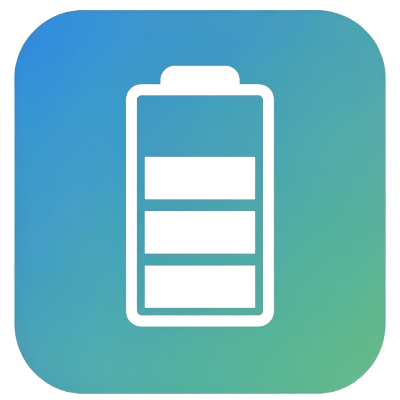
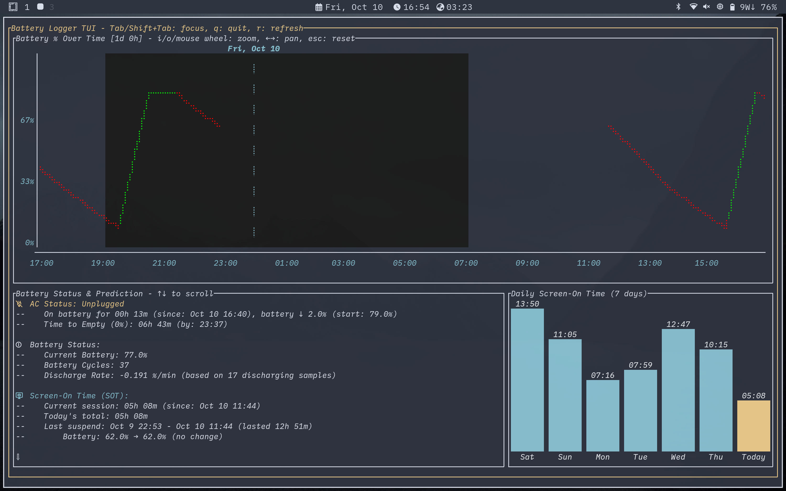

<div align="center">
	
</div>

# Battery Logger

*A lightweight Go daemon for battery monitoring, logging, and real-time visualization on Linux.*

<div align="center">
	
</div>


## Features

- Battery and power monitoring
- Configurable logging intervals
- Automatic log rotation
- Systemd integration
- **Interactive TUI**: real-time charts, predictions, zoom/pan, cycle count
- **Screen-On Time (SOT) tracking** - estimates daily usage patterns
- **Suspend/shutdown detection** - identifies system sleep periods and battery drain
- **Weekly SOT visualization** - bar charts showing daily usage trends


## Installation

```bash
./install.sh
```


## Usage

```bash
battery-logger run      # Start daemon
battery-logger tui      # Launch TUI
battery-logger status   # Show status
```

See [docs/TUI.md](docs/TUI.md) for advanced TUI features and controls.


## Service Management

```bash
make status     # Service status
make logs       # View logs
make stop       # Stop service
make start      # Start service
make uninstall  # Remove everything
```


## Configuration

Config files (TOML):
- [`internal/config/config.toml`](internal/config/config.toml) (local)
- `~/.config/battery-logger/config.toml` (user)
- `/etc/battery-logger/config.toml` (system)

Key settings:
- `interval_secs`: Data logging frequency (default: 60s)
- `suspend_gap_minutes`: Threshold for detecting suspend events (default: 5 min)
- `max_window_zoom`: Chart zoom limit in days (default: 10)
- Chart colors, log rotation, and timezone settings

See config file for all available options.


## Output

CSV log: `~/.local/state/battery-logger/battery.csv`


## Analytics & Predictions

The TUI provides comprehensive battery analytics:

- **Charge/Discharge Rates**: Calculated using exponential weighted regression (recent data weighted higher)
- **Time Estimates**: Predicts time to full charge or empty based on current usage patterns
- **SOT Calculation**: Estimates screen-on time by analyzing gaps in data logging (≥5 minutes = suspend/shutdown, configurable)
- **Current Session**: Active time since last wake/boot
- **Daily Trends**: Bar chart showing SOT for the past 7 days
- **Suspend Detection**: Tracks sleep periods and battery drain during suspend

> **Note**: SOT is calculated as a proxy based on continuous data logging. If the system is left idle with the screen off but battery-logger still running, it will count toward SOT. The calculation assumes logging gaps ≥5 minutes indicate system suspend/shutdown.


## Manual Service Installation

See [`systemd/`](systemd/) for service files. Use `make` or copy manually for custom setups.


## Uninstallation

```bash
./uninstall.sh
```


## Development

```bash
go build ./cmd/battery-logger
make clean
```


## Configuration Reference

All configuration options available in config files:

### Core Settings
- `interval_secs = 60` - Data logging frequency in seconds
- `interval_secs_on_ac = 60` - Logging frequency when AC connected
- `timezone = "Local"` - Timezone for timestamps
- `log_dir = "~/.local/state/battery-logger"` - Directory for log files
- `log_file = "battery.csv"` - Name of the CSV log file
- `max_lines = 4000` - Maximum lines in log before rotation
- `trim_buffer = 100` - Lines to keep when trimming log
- `max_charge_percent = 100` - Maximum charge threshold for predictions
- `suspend_gap_minutes = 5` - Gap threshold for detecting suspend/shutdown events

### TUI Settings
- `day_color_number = -1` - Terminal color for day data points (default foreground)
- `night_color_number = 234` - Terminal color for night data points (dark gray)
- `day_start_hour = 7` - Hour when day visualization starts (7 AM)
- `day_end_hour = 19` - Hour when night visualization starts (7 PM)
- `max_window_zoom = 10` - Maximum zoom window in days for charts
