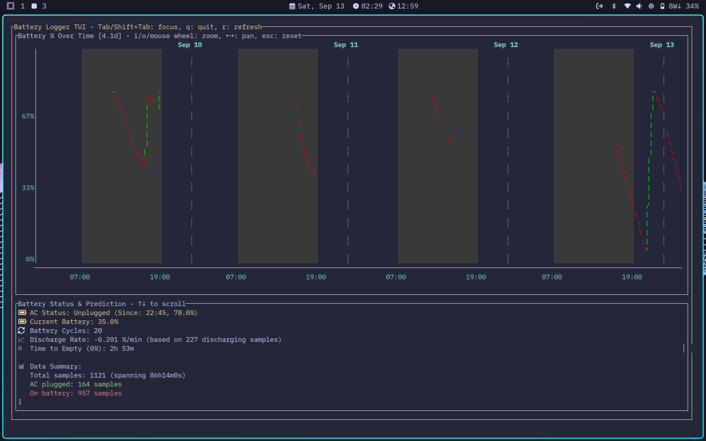

<div align="center">
	
</div>

# Battery Logger

*A lightweight Go daemon for battery monitoring, logging, and real-time visualization on Linux.*

<div align="center">
	
</div>


## Features

- Battery and power monitoring
- Configurable logging intervals
- Automatic log rotation
- Systemd integration
- Interactive TUI: real-time charts, predictions, zoom/pan, cycle count


## Installation

```bash
./install.sh
```


## Usage

```bash
battery-logger run      # Start daemon
battery-logger tui      # Launch TUI
battery-logger status   # Show status
```

See [docs/TUI.md](docs/TUI.md) for advanced TUI features and controls.


## Service Management

```bash
make status     # Service status
make logs       # View logs
make stop       # Stop service
make start      # Start service
make uninstall  # Remove everything
```


## Configuration

Config files (TOML):
- [`internal/config/config.toml`](internal/config/config.toml) (local)
- `~/.config/battery-logger/config.toml` (user)
- `/etc/battery-logger/config.toml` (system)

See config file for all options (intervals, log paths, chart colors, etc).


## Output

CSV log: `~/.local/state/battery-logger/battery.csv`


## Manual Service Installation

See [`systemd/`](systemd/) for service files. Use `make` or copy manually for custom setups.


## Uninstallation

```bash
./uninstall.sh
```


## Development

```bash
go build ./cmd/battery-logger
make clean
```