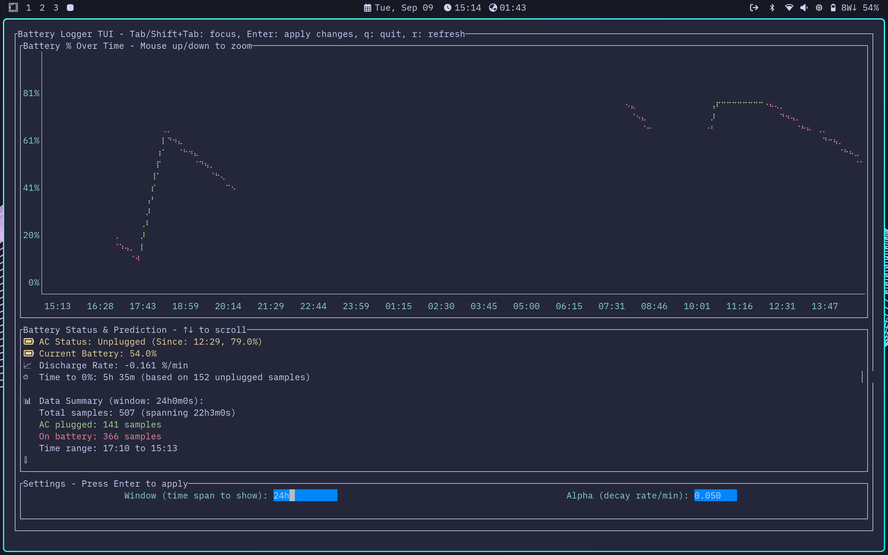

# Battery Logger



A lightweight Go daemon that logs battery status and power information to CSV files on Linux systems, and provides an interactive TUI for real-time data visualization and discharge prediction!

## Features

- Continuous battery monitoring with configurable intervals
- Different logging intervals for AC vs battery power
- Automatic log rotation when files grow too large
- Single-instance protection with PID files
- Systemd service integration
- XDG Base Directory compliant
- **Interactive TUI** for real-time data visualization and discharge prediction

## Installation
```bash
# Using the install script
./install.sh
```

## Usage

### Commands
```bash
battery-logger sample   # Take one sample
battery-logger run      # Run as daemon
battery-logger status   # Show current status
battery-logger trim     # Trim log to max lines
battery-logger tui      # Launch interactive TUI for data visualization
```

### TUI (Terminal User Interface)
The TUI provides real-time visualization of battery data with intelligent discharge prediction:

```bash
# Basic usage
battery-logger tui

# Focus on recent data with custom settings
battery-logger tui -window 30m -alpha 0.1
```

**Features:**
- 📊 Interactive line chart with mouse zoom support and real-time controls
- 🧮 Smart discharge rate calculation using weighted regression
- ⏱️ Time-to-empty predictions based on recent unplugged sessions
- 📈 Data insights and sample statistics
- ⌨️ Real-time parameter adjustment (Tab/Enter to change settings, q to quit, r to refresh)

See [docs/TUI.md](docs/TUI.md) for detailed TUI documentation.

### Service Management
```bash
make status     # Check service status
make logs       # View logs
make stop       # Stop service
make start      # Start service
make uninstall  # Remove everything
```

## Configuration

Configuration files are loaded in priority order:
1. `internal/config/config.toml` (project local)
2. `~/.config/battery-logger/config.toml` (user)
3. `/etc/battery-logger/config.toml` (system)

### Config Options
```toml
interval_secs = 60           # Sample interval on battery
interval_secs_on_ac = 300    # Sample interval on AC power
timezone = "local"           # "local" or "UTC"
log_dir = "~/.local/state/battery-logger"
log_file = "battery.csv"
max_lines = 1000            # Max lines before rotation
trim_buffer = 100           # Buffer for trimming
```

## Output

Battery data is logged to `~/.local/state/battery-logger/battery.csv`:
```csv
timestamp,ac_online,battery_percent
2025-09-08T17:30:00-05:00,true,85
2025-09-08T17:35:00-05:00,true,84
```

## Manual Service Installation

If you prefer manual systemd setup instead of using `make`:

**User service (recommended):**
```bash
cp systemd/battery-logger@.service ~/.config/systemd/user/battery-logger.service
# Edit ExecStart path if needed
systemctl --user daemon-reload
systemctl --user enable battery-logger.service
systemctl --user start battery-logger.service
```

**System service (requires root):**
```bash
sudo cp systemd/battery-logger.service /etc/systemd/system/
sudo systemctl daemon-reload
sudo systemctl enable battery-logger@$USER.service
sudo systemctl start battery-logger@$USER.service
```

## Uninstallation
```bash
# Stop service and remove everything
./uninstall.sh
```

> [!Note]
> Log files in `~/.local/state/battery-logger/` are preserved by default. Remove them manually if you want to delete your battery usage history.

## Development

```bash
# Build
go build ./cmd/battery-logger

# Test
battery-logger status

# Clean
make clean
```